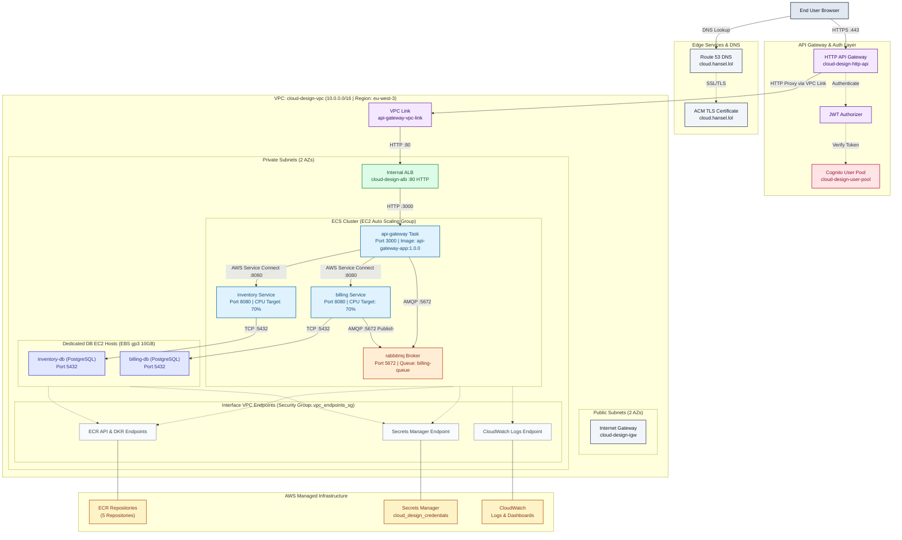

# Cloud Design

A modular microservices platform on AWS — API gateway, inventory service,
billing service, a message broker, and two PostgreSQL databases — built with
Terraform/ECS for the infrastructure and Docker Compose for local
development.

Interactive documentation: <https://kill-ux.github.io/cloud-design/>

---

## Overview

Six services, deployed identically in local Docker Compose and on AWS ECS:

| Service       | Port | Description                                             |
| ------------- | ---- | ------------------------------------------------------- |
| api-gateway   | 3000 | Public entry point, routes to inventory and billing     |
| inventory-app | 8080 | Manages inventory records, backed by its own database   |
| billing-app   | 8080 | Handles billing, consumes orders from the message queue |
| rabbitmq      | 5672 | Message broker connecting api-gateway and billing-app   |
| inventory-db  | 5432 | PostgreSQL database for inventory data                  |
| billing-db    | 5432 | PostgreSQL database for billing data                    |

Design priorities, in order:

1. **Security by default** — private-only data plane, least-privilege
   security groups, managed authentication
2. **Cost control** — EC2-based ECS capacity instead of Fargate, no NAT
   Gateway, budget alerting
3. **Operational simplicity** — service discovery over hardcoded addresses,
   CloudWatch dashboards, Makefile-driven workflows

---

## Architecture

```text
                                Internet
                                    |
                        Amazon API Gateway (HTTP API)
                        Cognito JWT Authorizer
                                    |
                              VPC Link
                                    |
                    Internal Application Load Balancer
                              (Public Subnet)
                                    |
    ------------------------- Private Subnet -------------------------
    |                                                                 |
    |   API Gateway App (3000)                                       |
    |        |                                                       |
    |        |----> RabbitMQ (5672) <----+                           |
    |        |                            |                          |
    |        |----> Inventory App (8080)  |----> Billing App (8080)  |
    |                    |                                |          |
    |                    v                                v          |
    |            Inventory DB (5432)               Billing DB (5432) |
    --------------------------------------------------------------------
```

Client requests reach the internal ALB only through API Gateway, which
enforces a Cognito-issued JWT before forwarding traffic over a VPC Link.
Nothing in the private subnet is reachable directly from the internet.

<details>
<summary>Full component diagram (Mermaid)</summary>



</details>

---

## Infrastructure design

### Networking

- Custom VPC, two public and two private subnets across two availability
  zones.
- Private subnets have no route to the internet — no NAT Gateway. Access to
  ECR, S3, ECS control plane, CloudWatch Logs, and Secrets Manager is
  provided exclusively through VPC endpoints.
- The Application Load Balancer is internal, reachable only through the API
  Gateway VPC Link.

### Compute

- ECS cluster backed by an EC2 Auto Scaling Group capacity provider
  (`t3.micro`), rather than Fargate, so the databases can sit on persistent
  EBS-backed storage while staying in a predictable cost envelope.
- Each application service runs as an ECS service with target-tracking auto
  scaling (CPU-based for inventory and billing, request-count-based for the
  API gateway).
- The two databases run as ECS tasks pinned to dedicated host instances via
  placement constraints, each with its own encrypted EBS volume.

### Security

- Security groups are chained by reference, not CIDR: ALB → API gateway app
  → services → databases. Nothing accepts inbound traffic from `0.0.0.0/0`.
- Cognito issues JWTs; API Gateway enforces them before any request reaches
  internal services.
- All application and database credentials live in AWS Secrets Manager and
  are injected into containers at runtime.
- EBS volumes backing the databases are encrypted at rest.

### Messaging and resilience

- RabbitMQ uses a durable, quorum-type queue for billing messages.
- The billing consumer acknowledges only after successfully persisting an
  order, and negatively acknowledges with requeue on failure, so in-flight
  messages survive a billing-service restart.

### Observability

- Application and database logs ship to CloudWatch via the `awslogs`
  driver.
- A CloudWatch dashboard tracks CPU and memory utilization across all ECS
  services.

### Cost management

- An AWS Budgets alert emails when spend crosses 80% of a $50/month
  threshold.
- Skipping NAT Gateway and Fargate in favor of VPC endpoints and a small EC2
  capacity provider keeps the baseline cost low; the ASG floor
  (`min_size = 4` `t3.micro` instances) is the main lever if you want to run
  it cheaper.

---

## Repository structure

```text
cloud-design/
├── docker/                      Local development environment
│   ├── srcs/                    Microservice source (api-gateway, inventory-app,
│   │                            billing-app, rabbitmq, postgres-db)
│   ├── docker-compose.yml       Local multi-container setup
│   ├── .env.example             Template for local environment variables
│   └── test/                    Load/CPU test scripts
├── terraform/
│   ├── foundation/               Stack 1: VPC, security groups, IAM, ECR,
│   │                             Secrets Manager, ACM cert — deploy first
│   ├── workload/                 Stack 2: ECS cluster/services, ALB,
│   │                             Cognito, API Gateway, dashboard, budget
│   └── modules/aws/              Reusable modules shared by both stacks
│       (vpc, ecs, ecs_task, ecs_db_instance, alb, ecr, iam,
│        security_group, secrets, acm, cognito, dashboard, ebs)
├── docs/                         Static documentation site (GitHub Pages)
├── res/                          Diagram/screenshot assets
├── commands.sh                   Example Cognito auth curl commands
├── Makefile                      Terraform / AWS operational shortcuts
└── README.md
```

`terraform/foundation` and `terraform/workload` are separate Terraform root
modules with independent S3 backend state — `workload` reads `foundation`'s
outputs via remote state, so `foundation` must exist first. Each has its own
README with stack-specific details, requirements, and cost breakdown.

---

## Prerequisites

- AWS CLI, configured with credentials for the target account
- Terraform 1.0 or later
- Docker and Docker Compose
- GNU Make

---

## Local development

```bash
git clone https://github.com/kill-ux/cloud-design.git
cd cloud-design/docker
cp .env.example .env   # fill in real values
docker compose up --build
```

This starts all six services locally with the same environment variables,
health checks, and networking relationships used in production. Images are
built from `docker/srcs/*`; `docker/Makefile` also has `build`/`push`
targets for publishing them to Docker Hub / ECR under the `1.0.0` tag that
`terraform/workload` expects.

---

## Infrastructure deployment

Deploy the two stacks in order:

```bash
cd terraform/foundation
cp terraform.tfvars.example terraform.tfvars   # fill in real values
terraform init && terraform apply

cd ../workload
cp terraform.tfvars.example terraform.tvars    # fill in real values
terraform init && terraform apply
```

The root `Makefile` wraps common Terraform/AWS operations — run it from
inside whichever stack directory you're working in:

| Command                 | Description                                 |
| ----------------------- | ------------------------------------------- |
| `make plan`             | Preview infrastructure changes              |
| `make apply`            | Apply infrastructure changes                |
| `make destroy`          | Tear down all infrastructure, including ECR |
| `make destroy-keep-ecr` | Tear down infrastructure, preserving ECR    |
| `make ssh`              | Connect to the running ECS host instance    |
| `make cluster`          | Show ECS cluster status                     |
| `make services`         | List active ECS services                    |
| `make lint`             | Format and validate Terraform code          |

Run `make help` for the full list. Note the `plan`/`apply`/`destroy` targets
call `terraform ... -var-file=env.tfvars` — either name your tfvars file
`env.tfvars`, or invoke plain `terraform plan`/`apply` directly against the
`terraform.tfvars` already in each stack directory.

---
