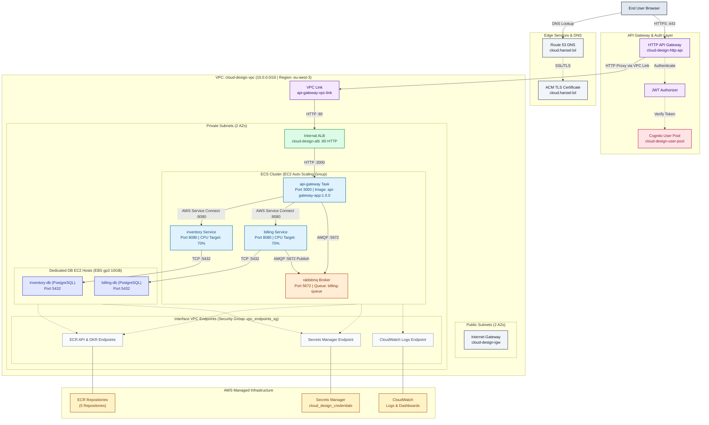

# Cloud Design

A modular microservices infrastructure provisioned on AWS using Terraform and Amazon ECS, with an emphasis on cost control, least-privilege networking, and managed authentication.

Interactive documentation: <https://kill-ux.github.io/cloud-design/>

---

## Overview

This project deploys a five-service microservices architecture (API gateway, inventory service, billing service, message broker, and two PostgreSQL databases) on AWS. The infrastructure is fully described in Terraform and split into reusable modules, with a local Docker Compose environment for development that mirrors the production topology.

Design priorities, in order:

1. Security by default (private-only data plane, least-privilege security groups, managed authentication)
2. Cost control (EC2-based ECS capacity instead of Fargate, no NAT Gateway, budget alerting)
3. Operational simplicity (service discovery over hardcoded addresses, CloudWatch dashboards, Makefile-driven workflows)

---

## Architecture

```text
                                Internet
                                    |
                        Amazon API Gateway (HTTP API)
                        Cognito JWT Authorizer
                                    |
                              VPC Link
                                    |
                    Internal Application Load Balancer
                              (Public Subnet)
                                    |
    ------------------------- Private Subnet -------------------------
    |                                                                 |
    |   API Gateway App (3000)                                       |
    |        |                                                       |
    |        |----> RabbitMQ (5672) <----+                           |
    |        |                            |                          |
    |        |----> Inventory App (8080)  |----> Billing App (8080)  |
    |                    |                                |          |
    |                    v                                v          |
    |            Inventory DB (5432)               Billing DB (5432) |
    --------------------------------------------------------------------
```

Client requests reach the internal ALB only through API Gateway, which enforces a Cognito-issued JWT before forwarding traffic over a VPC Link. Nothing in the private subnet is reachable directly from the internet.

### Components

| Service       | Port | Description                                             |
| ------------- | ---- | ------------------------------------------------------- |
| api-gateway   | 3000 | Entry point routing requests to inventory and billing   |
| inventory-app | 8080 | Manages inventory records, backed by its own database   |
| billing-app   | 8080 | Handles billing, consumes orders from the message queue |
| rabbitmq      | 5672 | Message broker connecting api-gateway and billing-app   |
| inventory-db  | 5432 | PostgreSQL database for inventory data                  |
| billing-db    | 5432 | PostgreSQL database for billing data                    |

---

## Infrastructure Design

### Networking

- Custom VPC with two public and two private subnets across two availability zones.
- Private subnets have no route to the internet. Access to AWS services (ECR, S3, CloudWatch Logs) is provided exclusively through VPC endpoints, removing the need for a NAT Gateway.
- The Application Load Balancer is internal and only reachable through the API Gateway VPC Link.

### Compute

- ECS cluster backed by an EC2 Auto Scaling Group capacity provider (t3.micro instances), rather than Fargate, to keep the databases on persistent, EBS-backed storage while remaining within a predictable cost envelope.
- Each application service runs as an ECS service with target-tracking auto scaling (CPU-based for inventory and billing, request-count-based for the API gateway).
- The two databases run as ECS tasks pinned to dedicated host instances via placement constraints, with encrypted EBS volumes attached for durable storage.

### Security

- Security groups are chained by reference rather than by CIDR: ALB to API gateway, API gateway to services, services to databases. No security group allows inbound traffic from `0.0.0.0/0`.
- Authentication is handled by Amazon Cognito, with a JWT authorizer enforced at the API Gateway layer before any request reaches internal services.
- All application and database credentials are stored in AWS Secrets Manager and injected into containers at runtime; no credentials are stored in source control.
- EBS volumes backing the databases are encrypted at rest.

### Messaging and Resilience

- RabbitMQ uses a durable, quorum-type queue for billing messages.
- The billing consumer acknowledges messages only after successfully persisting an order, and negatively acknowledges with requeue on failure, so in-flight messages survive a restart of the billing service.

### Observability

- Application and database logs are shipped to CloudWatch via the `awslogs` driver.
- A CloudWatch dashboard tracks CPU and memory utilization across all ECS services.

### Cost Management

- An AWS Budgets alert notifies by email when spend crosses 80 percent of a defined monthly threshold.
- Avoiding NAT Gateways and Fargate in favor of VPC endpoints and a small EC2 capacity provider keeps baseline infrastructure cost low.

---

## Repository Structure

```text
cloud-design/
├── docker/                    Local development environment
│   ├── srcs/                  Microservice source code
│   └── docker-compose.yml     Local multi-container setup
├── terraform/
│   ├── main.tf                Root module composition
│   ├── provider.tf             AWS provider and remote state configuration
│   ├── services.tf             Security groups and ECS service definitions
│   ├── variables.tf            Input variables
│   ├── output.tf                Infrastructure outputs
│   └── modules/aws/             Reusable modules (vpc, ecs, ecs_task, alb, ecr,
│                                 iam, security_group, secrets, cognito, dashboard,
│                                 ebs, ecs_db_instance)
├── docs/                       Static documentation site
├── Makefile                    Terraform and AWS operational shortcuts
└── README.md
```

---

## Prerequisites

- AWS CLI, configured with credentials for the target account
- Terraform 1.0 or later
- Docker and Docker Compose
- GNU Make

---

## Local Development

```bash
git clone https://github.com/kill-ux/cloud-design.git
cd cloud-design/docker
docker-compose up --build
```

This starts all six services locally with the same environment variables, health checks, and networking relationships used in production.

---

## Infrastructure Deployment

1. Configure variables:

   ```bash
   cd terraform
   cp terraform.tfvars.example env.tfvars
   # edit env.tfvars with the target region and credentials
   ```

2. Deploy:

   ```bash
   make init
   make validate
   make plan
   make apply
   ```

---

## Operational Commands

| Command                 | Description                                 |
| ----------------------- | ------------------------------------------- |
| `make plan`             | Preview infrastructure changes              |
| `make apply`            | Apply infrastructure changes                |
| `make destroy`          | Tear down all infrastructure, including ECR |
| `make destroy-keep-ecr` | Tear down infrastructure, preserving ECR    |
| `make ssh`              | Connect to the running ECS host instance    |
| `make cluster`          | Show ECS cluster status                     |
| `make services`         | List active ECS services                    |
| `make lint`             | Format and validate Terraform code          |

Run `make help` for the full list.

---

## Known Limitations and Future Work

- The ALB listener currently serves HTTP internally; TLS is terminated at the API Gateway default endpoint. Adding a custom domain with an AWS Certificate Manager certificate would allow end-to-end encryption under a dedicated hostname.
- Amazon Inspector is not yet enabled for continuous vulnerability scanning of ECS instances and container images; this is a natural next addition alongside ECR scan-on-push.
- A content delivery network and function-as-a-service components are not implemented, and remain candidates for future iteration.

